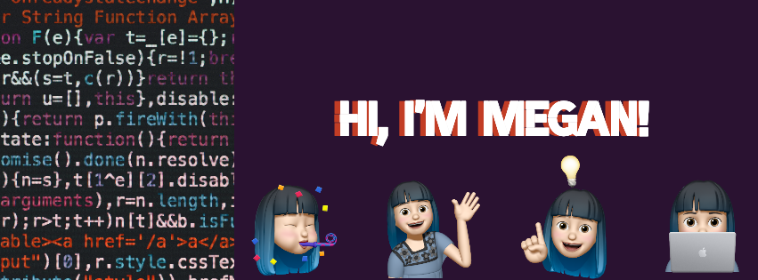

 

I'm currently pursuing a Master's degree in Software Engineering at the University of British Columbia.

<ul>
  <li>:briefcase: Working part-time at Texavie on <strong>iOS and Web development</strong>.</li>
  <li>:mortar_board: Has a Bachelor of Applied Science degree in Mechanical Engineering at the University of British Columbia.</li>
</ul>

Feel free to send me an email if you'd like to chat!

***
### Some Stats

 

  <!--
- 🔭 I’m currently working on ...
- 🌱 I’m currently learning ...
- 👯 I’m looking to collaborate on ...
- 🤔 I’m looking for help with ...
- 💬 Ask me about ...
- 📫 How to reach me: ...
- 😄 Pronouns: ...
- ⚡ Fun fact: ...
-->
